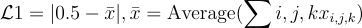
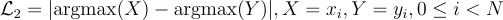

# Introduction
This is the code implementation of our solution for the second challenge of AI Hackthon hold by Argonne National Laboratory. Our team members are [Hyun Park](https://www.linkedin.com/in/hyun-park-08196a148/), [Boyuan Yu](https://www.linkedin.com/in/boyuan-yu-92940b196/), [Ziyi Kou](https://ziyikou.me/) and [Ajay Uppili Arasanipalai](https://www.linkedin.com/in/ajayuppili). We won the challenge! We show the results of our model below.

# Method
We used UNet model as our main network structure and MSE loss as the major loss. We then developed two other loss functions to further regulate the optimization process as follows. 
1. Fraction Volume Loss

2. Peak Loss

We implemented several data augmentation strategies to improve the robustness of our model as follows.
* Random flip for inputs.
* Multiple time-step data
* Tiled inputs for testing samples to test larger inputs.

# Train&Test
To train our model. You need to first create a W&B account and configure the access key in your local machine. Then you can clone the repo and run the command below.

    python main_3d_mt.py --num_workers 0 --gpu --epoches 50 --pad_size 64 --batch_size 32 --cin 2 --h5_times 39 --aug --unet_atten --activation sigmoid --lr 1e-3 --loss05 0.5 --loss_peak 0.01 --log
The trained model will be saved in your W&B account. You can download it and do the testing as follows.

    python main_3d_mt_test.py --num_workers 0 --gpu --epoches 50 --pad_size 64 --batch_size 32 --cin 2 --h5_times 39 --aug --unet_atten --activation sigmoid --lr 1e-3 --loss05 0.5 --loss_peak 0.01 --tile 1 --test_samples 5 --test_steps 100
To generate some of the physical correctness figures, run utils.py. In order to do so, change roots in <if **name**=="**main**"> to the user specified directory. Then create a folder named "results" where generated data produced from main_3d_mt_test.py (above code) is saved. Finally, run the following.

    python utils.py  
Please note that our data is not public. You may need to use your own data or generate random inputs to run through all processes.
# Exploration
We also created some other models in the repo. But all of them achieved worse performance compared to our final UNet model. If you are interested, you can explore them by running the same commands as the above commands except replacing the running python files. If you have any problem, you can post issues in the github. We will reply to them asap. Thank you.